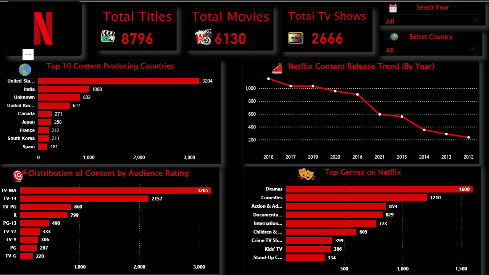
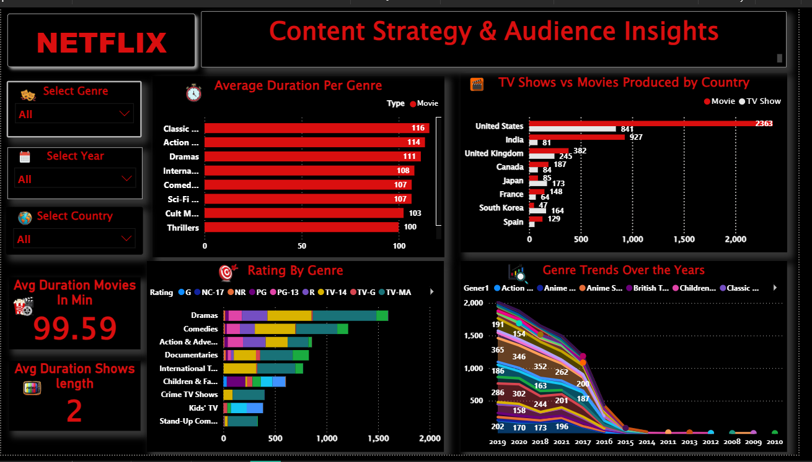
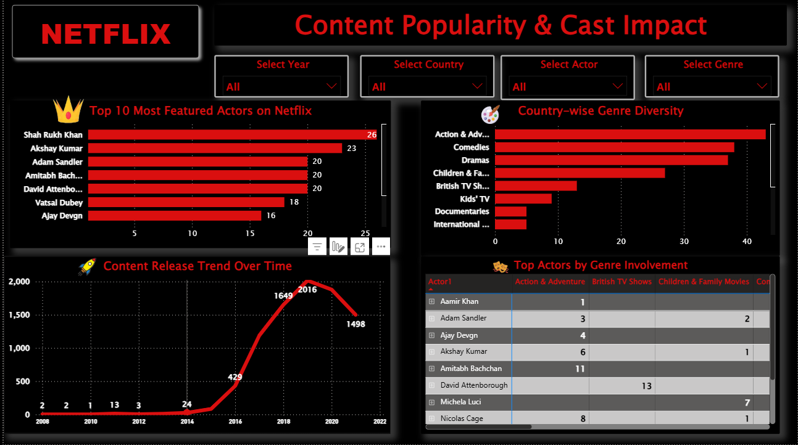

# 🎬 Netflix Power BI Dashboard
This interactive dashboard visualizes global Netflix content data including title counts, genres, audience ratings, cast presence, and release trends. Designed using Microsoft Power BI with a focus on business insights, storytelling, and interactivity.

---

## 📂 Project File

- 🔗 [Netflix_Analysis.pbix](./Netflix_Analysis.pbix)

## 📊 Dashboard Preview

### 🟥 Page 1 – Overall Content Overview

- 🔢 Total Titles, Movies, TV Shows
- 🌍 Top Content Producing Countries
- 📈 Netflix Release Trends
- 🎯 Content Rating Distribution
- 🎭 Top Genres

---

### 🟧 Page 2 – Strategy & Audience Insights

- ⏱️ Average Duration by Genre
- 🎞️ Movie vs TV Show Production by Country
- 📊 Rating vs Genre Comparison
- 🌀 Genre Trends Over the Years

---

### 🟩 Page 3 – Popularity & Cast Impact

- 👑 Top 10 Most Featured Actors
- 🎭 Actor Genre Involvement Matrix
- 🚀 Actor Popularity Over Time
- 🌐 Country-wise Genre Diversity

---

## 🎯 Key Insights

- 🇺🇸 The US dominates Netflix content production.
- 📺 TV-MA is the most common audience rating.
- 🎬 Dramas and Comedies lead across all genres.
- 👑 Shah Rukh Khan is one of the most featured actors.
- 📈 2019–2021 saw the highest content releases.

---

## 📌 Tools Used

- **Power BI Desktop**
- DAX (Data Analysis Expressions)
- Power Query
- GitHub for version control & showcase

---

## 🚀 How to Use

1. Clone/download the `.pbix` file.
2. Open it using Power BI Desktop.
3. Interact with slicers to explore filters.

---

## 📧 Contact

Connect with me on [LinkedIn](https://www.linkedin.com/in/anuvemali15)  
Feel free to ⭐ star this repo if you found it useful!

---

